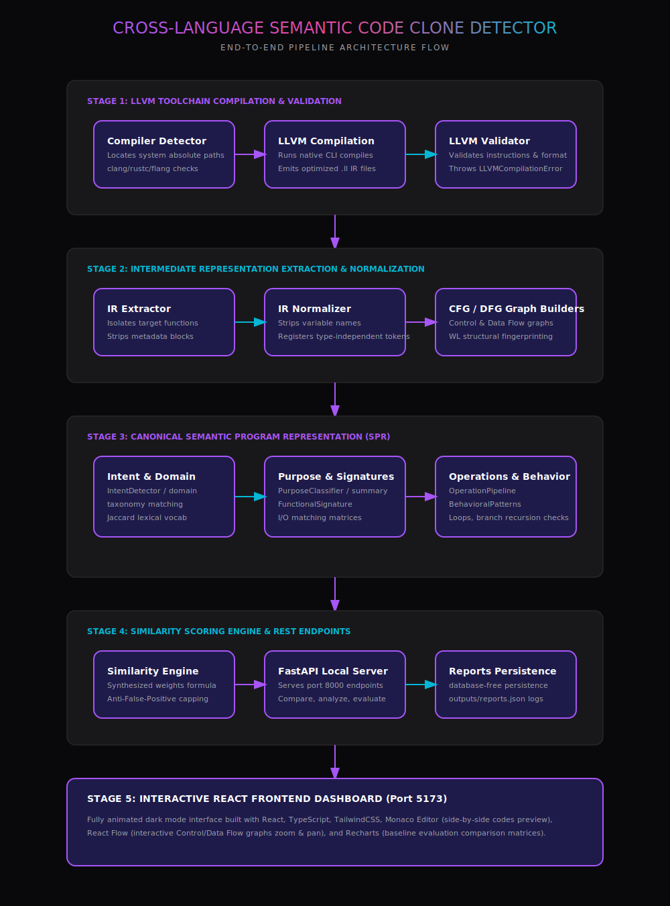

# System Design Document

## Cross-Language Semantic Code Clone Detector

### Design Overview

This document describes the architecture and design decisions for the Cross-Language Semantic Code Clone Detector, a sophisticated system that identifies semantically equivalent code implementations across multiple programming languages using LLVM Intermediate Representation (IR) as a language-agnostic normalization layer.

---

## 1. Architecture Overview

### 1.1 High-Level Architecture

The system follows a modular pipeline architecture with five primary stages:

```
Source Code → Compilation → Normalization → Graph Extraction → Similarity Analysis
```

Each stage is independent and can be extended or replaced without affecting other stages.

For a comprehensive diagram showing the detailed compilers verification and anti-false-positive pipeline stage gates, refer to [docs/architecture_diagram.svg](docs/architecture_diagram.svg):



### 1.2 Component Diagram

```
┌─────────────────────────────────────────────────────────────────────┐
│                         Frontend Layer                               │
│  ┌──────────┐  ┌──────────┐  ┌──────────┐  ┌──────────┐           │
│  │Dashboard │  │ Upload   │  │ Analysis │  │ Graph    │            │
│  │  Page    │  │  Page    │  │  Page    │  │  Viewer  │            │
│  └────┬─────┘  └────┬─────┘  └────┬─────┘  └────┬─────┘           │
│       │              │              │              │                 │
│       └──────────────┴──────────────┴──────────────┘                 │
│                             │                                        │
│                    REST API (JSON)                                   │
└─────────────────────────┬───────────────────────────────────────────┘
                          │
┌─────────────────────────┴───────────────────────────────────────────┐
│                        Backend Layer                                 │
│                                                                       │
│  ┌────────────────────────────────────────────────────────────────┐ │
│  │                    FastAPI Application                          │ │
│  │   ┌───────────┐  ┌───────────┐  ┌───────────┐  ┌───────────┐ │ │
│  │   │  Upload   │  │  Compile  │  │  Similarity│  │  Export   │  │ │
│  │   │ Endpoint  │  │ Endpoint  │  │  Endpoint │  │  Endpoint │ │ │
│  │   └─────┬─────┘  └─────┬─────┘  └─────┬─────┘  └─────┬─────┘ │ │
│  └─────────┼──────────────┼──────────────┼──────────────┼─────────┘ │
│            │              │              │              │            │
│  ┌─────────┴──────────────┴──────────────┴──────────────┴─────────┐ │
│  │                    Core Processing Engine                      │ │
│  │                                                                 │ │
│  │  ┌──────────────┐  ┌──────────────┐  ┌──────────────┐        │ │
│  │  │  Compiler    │  │     IR       │  │    Graph     │         │ │
│  │  │  Pipeline    │→ │  Normalizer  │→ │  Extractor   │         │ │
│  │  └──────────────┘  └──────────────┘  └───────┬──────┘        │ │
│  │                                               │                │ │
│  │  ┌──────────────┐  ┌──────────────┐  ┌───────┴──────┐        │ │
│  │  │  Similarity  │← │  Embedding   │← │   Fingerprint│         │ │
│  │  │   Engine     │  │   Engine     │  │   Engine    │          │ │
│  │  └──────────────┘  └──────────────┘  └──────────────┘        │ │
│  └─────────────────────────────────────────────────────────────────┘ │
└─────────────────────────────────────────────────────────────────────┘
```

---

## 2. LLVM Pipeline Design

### 2.1 Why LLVM IR?

LLVM IR was chosen as the normalization layer for several compelling reasons:

**Advantages:**
1. **Language Independence**: Single representation for multiple source languages
2. **Mature Infrastructure**: Well-tested, production-quality compiler framework
3. **Rich Semantics**: Preserves program meaning across transformations
4. **SSA Form**: Static Single Assignment simplifies data flow analysis
5. **Explicit Control Flow**: Clear representation of branching and loops

**Alternatives Considered:**

| Alternative | Pros | Cons | Decision |
|-------------|------|------|----------|
| Abstract Syntax Trees (AST) | Language-specific, detailed | No cross-language compatibility | Rejected |
| Binary Analysis | Platform-independent | Loses high-level semantics | Rejected |
| Custom IR | Tailored design | Reinventing the wheel | Rejected |
| JVM Bytecode | Cross-language (for JVM languages) | Limited to JVM ecosystem | Rejected |

### 2.2 Compilation Pipeline Design

```
┌─────────────┐
│ Source File │
│  (.c/.cpp)  │
└──────┬──────┘
       │
       ▼
┌─────────────────────────────────────┐
│  Clang/Clang++                       │
│  ├── -O2 optimization level          │
│  ├── -S emit assembly (IR)           │
│  ├── -emit-llvm                      │
│  └── -fno-discard-value-names        │
└──────────────┬──────────────────────┘
               │
               ▼
        ┌─────────────┐
        │  LLVM IR    │
        │   (.ll)     │
        └──────┬──────┘
               │
               ▼
┌─────────────────────────────────────┐
│  Normalization Engine               │
│  ├── Remove debug metadata          │
│  ├── Normalize variable names       │
│  ├── Canonicalize instructions      │
│  └── Remove annotations             │
└──────────────┬──────────────────────┘
               │
               ▼
┌─────────────────────────────────────┐
│   Normalized IR                     │
│   (Language-agnostic)               │
└─────────────────────────────────────┘
```

---

## 3. CFG/DFG Extraction Design

### 3.1 Control Flow Graph Design

The CFG represents the flow of control through a program:

**Nodes: Basic Blocks**
- Sequences of instructions with single entry and exit
- Property: internal instructions execute sequentially
- Terminator: last instruction determines successor

**Edges: Control Flow**
- Unconditional branches: single successor
- Conditional branches: two successors (true/false)
- Switch statements: multiple successors

**Data Structure:**
```python
class BasicBlock:
    label: str
    instructions: List[str]
    predecessors: Set[str]
    successors: Set[str]
    is_entry: bool
    is_exit: bool
    terminator_type: str
```

### 3.2 Data Flow Graph Design

The DFG represents data dependencies between operations:

**Nodes: Variables/Values**
- Definition nodes: where values are assigned
- Use nodes: where values are consumed

**Edges: Data Dependencies**
- Def-use chains: definition to use
- SSA edges: phi node inputs

**Data Structure:**
```python
class DFGNode:
    id: str
    variable: str
    operation: str
    is_def: bool
    is_use: bool
```

### 3.3 Graph Properties Computed

**CFG Metrics:**
- Cyclomatic complexity: M = E - N + 2P
- Dominator tree: immediate dominators
- Loop detection: back edges
- Strongly connected components

**DFG Metrics:**
- Definition count
- Use count
- Live variable analysis
- SSA form indicators

---

## 4. Similarity Computation Strategy

### 4.1 Multi-Metric Approach

The system uses four complementary similarity metrics:

```
Overall Similarity =
    0.30 × CFG Similarity +
    0.30 × DFG Similarity +
    0.30 × Embedding Similarity +
    0.10 × IR Token Similarity
```

**Rationale for Weights:**

| Metric | Weight | Rationale |
|--------|--------|-----------|
| CFG | 30% | Core structural representation of control flow |
| DFG | 30% | Captures data dependencies and transformations |
| Embedding | 30% | Captures semantic patterns via ML |
| IR Token | 10% | Additional syntactic similarity signal |

### 4.2 CFG Similarity Computation

```python
def compute_cfg_similarity(cfg_a, cfg_b):
    similarities = []

    # 1. Size similarity (20%)
    size_ratio = min(nodes_a, nodes_b) / max(nodes_a, nodes_b)
    similarities.append(size_ratio * 0.20)

    # 2. Edge density (20%)
    density_ratio = compare_graph_densities(cfg_a, cfg_b)
    similarities.append(density_ratio * 0.20)

    # 3. Cyclomatic complexity (20%)
    cc_ratio = compare_cyclomatic_complexities(cfg_a, cfg_b)
    similarities.append(cc_ratio * 0.20)

    # 4. Terminator distribution (20%)
    term_sim = compare_terminator_types(cfg_a, cfg_b)
    similarities.append(term_sim * 0.20)

    # 5. Graph edit distance (20%)
    ged_sim = approximate_ged(cfg_a, cfg_b)
    similarities.append(ged_sim * 0.20)

    return sum(similarities)
```

### 4.3 Embedding Methodology

**Weisfeiler-Lehman Graph Hashing:**

Used for fast structural comparison through iterative neighborhood aggregation:

```
Iteration 0: Initialize node labels
Iteration i: Concatenate label with sorted neighbor labels → hash
Iteration n: Combine all node hashes → graph hash
```

**Graph2Vec Embedding:**

Generates fixed-length vector from graph using:
1. WL feature extraction at multiple iterations
2. Feature histogram creation
3. Neural embedding (simplified to structural features)

---

## 5. Dashboard Architecture

### 5.1 Frontend Architecture

```
┌─────────────────────────────────────────────┐
│              React Application               │
├─────────────────────────────────────────────┤
│  Pages:                                     │
│  ├── Dashboard (stats, charts)             │
│  ├── Upload (drag-drop, file list)          │
│  ├── Analysis (comparison, results)         │
│  ├── Graphs (CFG/DFG visualization)         │
│  └── IR Viewer (IR display, normalize)      │
├─────────────────────────────────────────────┤
│  Components:                                │
│  ├── Layout (sidebar, navigation)            │
│  ├── FileUpload (dropzone)                  │
│  ├── GraphVisualization (network display)   │
│  └── SimilarityResults (table, cards)       │
├─────────────────────────────────────────────┤
│  State Management:                          │
│  └── React hooks (useState, useEffect)      │
└─────────────────────────────────────────────┘
```

### 5.2 Backend Architecture

```
┌─────────────────────────────────────────────┐
│            FastAPI Application               │
├─────────────────────────────────────────────┤
│  Middleware:                                │
│  ├── CORS (cross-origin requests)           │
│  └── Exception handlers                     │
├─────────────────────────────────────────────┤
│  Routers:                                   │
│  ├── /upload (file upload)                   │
│  ├── /compile/{file_id} (IR generation)      │
│  ├── /graphs/{file_id}/{func} (CFG/DFG)      │
│  ├── /similarity (comparison)                │
│  ├── /analyze (batch processing)             │
│  └── /dashboard/stats (statistics)           │
├─────────────────────────────────────────────┤
│  Core Modules:                              │
│  ├── compiler_pipeline                       │
│  ├── ir_normalizer                          │
│  ├── graph_extractor                        │
│  ├── embedding_engine                       │
│  └── similarity_engine                      │
└─────────────────────────────────────────────┘
```

---

## 6. Design Alternatives Analysis

### 6.1 IR Normalization Strategy

**Chosen Approach: Aggressive Normalization**
- Remove all debug metadata
- Canonicalize variable names
- Remove language-specific annotations

**Alternative: Conservative Normalization**
- Keep some contextual information
- Risk: Language-specific artifacts may affect similarity

**Decision:** Aggressive normalization chosen for cross-language fairness.

### 6.2 Graph Representation

**Chosen: NetworkX DiGraph**
- Mature library
- Rich algorithm support
- Easy serialization

**Alternatives:**
- Custom graph structure: More control but reinvent algorithms
- Graph databases: Overkill for in-memory analysis
- pygraphviz: Better visualization but less flexible

**Decision:** NetworkX for flexibility and algorithm support.

### 6.3 Similarity Weighting

**Chosen: Fixed weights (30/30/30/10)**
- Deterministic behavior
- Equal emphasis on CFG, DFG, embedding

**Alternative: Learned weights**
- Could adapt to specific domains
- Requires training data
- Less interpretable

**Decision:** Fixed weights for reproducibility and interpretability.

---

## 7. Challenges and Trade-offs

### 7.1 Language-Specific Artifacts

**Challenge:** Different compilers generate different IR patterns.

**Solution:** Aggressive normalization removes:
- Debug info (!dbg metadata)
- Calling conventions
- Compiler-specific attributes
- Language-specific naming patterns

### 7.2 False Positives/Negatives

**Challenge:** Perfect semantic comparison is undecidable.

**Mitigation:**
- Multiple complementary metrics reduce errors
- Confidence scores indicate reliability
- User interpretation of results

### 7.3 Performance vs Accuracy

**Trade-off:** More sophisticated analysis is slower.

**Compromise:**
- Fast approximate GED (instead of exact)
- Iterative refinement options
- Background processing for large datasets

### 7.4 Cross-Language Complexity

**Challenge:** Different optimization levels produce different IR.

**Solution:**
- Normalize optimization artifacts
- Compare at consistent optimization levels
- Use multiple compilation passes when detected

---

## 8. Data Flow Design

### 8.1 Request Processing Flow

```
HTTP Request
    │
    ├── Validate Input
    ├── Process File(s)
    │   ├── Store temporarily
    │   ├── Detect language
    │   └── Compile to IR
    ├── Normalize IR
    ├── Extract Graphs
    ├── Generate Embeddings
    ├── Compute Similarity
    ├── Format Response
    └── Return JSON
```

### 8.2 Background Processing

```
Batch Analysis Request
    │
    ├── Create job record
    ├── Queue for processing
    ├── Process each file
    │   ├── Compile
    │   ├── Extract functions
    │   └── Generate fingerprints
    ├── Compare all pairs
    ├── Update progress
    └── Store results
```

---

## 9. Security Considerations

### 9.1 Input Validation

- File type checking (extension + content)
- Size limits (prevent resource exhaustion)
- Path traversal prevention

### 9.2 Resource Management

- Temporary file cleanup
- Memory limits for large files
- Timeout for compilation processes

---

## 10. Extensibility Design

### 10.1 Adding New Languages

1. Define language configuration
2. Map file extensions to compilers
3. Implement compilation strategy
4. Add normalization rules if needed

### 10.2 Adding New Similarity Metrics

1. Implement metric computation
2. Add to similarity engine
3. Update weight configuration
4. Adjust total for sum to 1.0

### 10.3 Adding New Functional Categories

1. Extend category list in config
2. Add detection logic to predictor
3. Update UI display components

---

## Conclusion

The design of the Cross-Language Semantic Clone Detector balances accuracy, performance, and maintainability through:

- Modular architecture enabling independent evolution
- LLVM IR as a stable, language-agnostic representation
- Multiple complementary similarity metrics
- Clear separation of concerns between components
- Extensible design for future enhancements

The system achieves its goal of providing reliable cross-language semantic clone detection while maintaining reasonable performance and clear interpretability of results.
